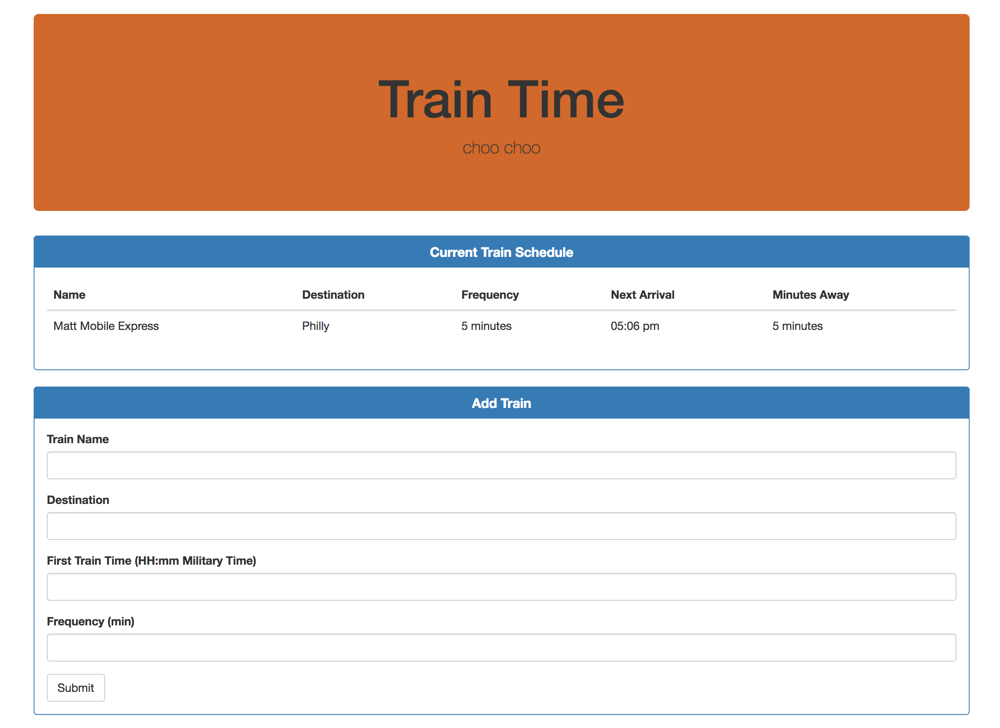

# Train-Scheduler

## About
This app provides the arrival times of trains. Users enter a train name, destination, and frequency. The app then calculates the next arrival time of the train and appends all the train's data on to a table using jQuery. The appended data is saved onto the app via firebase. <a href="https://mjefferis.github.io/Train-Scheduler/"> Click here for the live webpage. </a>

## Technologies Used
HTML/CSS/Bootstrap 
Javascript/jQuery 
Firebase 
Moment.js 

## Future Improvements
I hope to incorporate user input validation as I do not want bad data appended to the table. Also, I hope to make the app take into consideration that not all trains run 24/7. 

